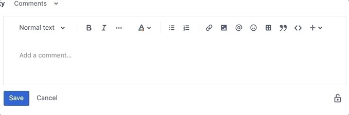

# myMacros

myMacros is a Google Chrome extension which allows the use of certain macros in Jira to quickly load specific templates.

## Installation

1. Clone the repository or download the latest release zip [here](https://github.com/jbrulmans/qa-macros/releases).
2. Unzip the release zip.
3. Navigate to `chrome://extensions/` in your Google Chrome browser.
4. At the top right, turn on _Developer mode_.
5. Click _Load unpacked_.
6. Find and select the root of the repository or unzipped extension folder.
7. _myMacros_ should now appear in your list of extensions.

## Usage
In any Jira comment or input field, the following macros can be used to quickly load specific templates:

```
\bug            # replaced by default template for verifying a bug
\session        # replaced by default template for Session testing
\explorative    # replaced by default template for Explorative testing
\rc             # replaced by default template for Release Candidate testing
```



## Templates
Currently there's no option yet to change the templates in the extension itself. You can however change the templates yourself by changing the corresponding `.txt` and `.html` files in the 'templates' folders **before** loading the unpacked folder.

The possibility to change the templates via the option page is currenlty in development and should be released soon.

## Contributing
Pull requests are welcome. For major changes, please open an issue first to discuss what you would like to change.

## License
[GNU GPLv3](https://choosealicense.com/licenses/gpl-3.0/)
